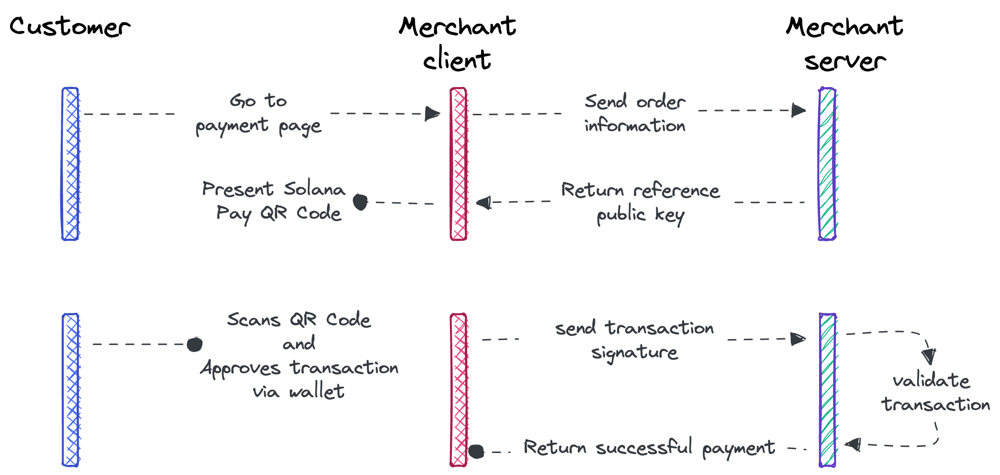

# Solana Payment SDK

Solana Payment SDK is a standard protocol and set of reference implementations that enable developers to incorporate decentralized payments into their apps and services.

The Solana blockchain confirms transactions in less than a second and costs on average **$0.0005**, providing users a seamless experience with no intermediaries.

# Getting Involved
Solana Payment SDK is an open standard to facilitate commerce on Solana. We are looking for more contributors to help develop the ecosystem. Here are a few ideas if you're looking to get involved.

## Hackathon Projects
The [Solana Grizzlython Hackathon](https://solana.com/grizzlython) is happening right now. There's a dedicated Payments track, presented by Stripe.

Here are some [Solana Pay hackathon ideas](https://www.figma.com/community/file/1070574785723157359) to get started thinking about how you can build the future of payments.

## eCommerce Platform Integrations
To get as many merchants accepting payments on Solana Payment SDK as possible we need to provide easy ways to set up Solana Payment SDK on all eCommerce platforms.

Here are some of the top eCommerce platforms that we're looking to integrate to:

- WooCommerce
- Magento
- BigCommerce
- Wix
- Squarespace